# LLM Orchestration

A robust, modular system for orchestrating complex workflows with multiple Large Language Model (LLM) instances. Designed for data engineering and machine learning teams, it enables reusable prompt engineering, workflow chaining, and real-time execution tracking—ideal for production ML pipelines and rapid prototyping.

---

## 🚀 Key Features

- **Composable Prompt Blocks:** Build reusable text blocks for LLM prompts.
- **Configurable Payloads:** Define LLM settings (temperature, model, etc.) per request.
- **Workflow Orchestration:** Chain payloads into multi-step workflows with variable substitution.
- **Real-Time Execution:** Monitor workflow runs and LLM responses live via WebSocket.
- **Rich API & UI:** Manage blocks, payloads, workflows, and runs programmatically or through the web interface.
- **Extensible & AI-Friendly:** Modular codebase, clear documentation, and AI-context comments for rapid onboarding and extension.

---

## 🏗️ Architecture Overview

The system is built around these core concepts:

## 🖼️ GUI Overview


<h3>Block Manager</h3>
<p>Manage and edit reusable prompt blocks.</p>


<h3>Payload Builder</h3>
<p>Configure LLM settings and assemble blocks into payloads.</p>


<h3>Workflow Builder</h3>
<p>Chain payloads into multi-step workflows.</p>


<h3>Workflow Runs & Responses</h3>
<p>Track execution progress and review LLM responses for each workflow run.</p>


<h3>LLM Connectivity Test</h3>
<p>Test and validate connectivity to your LLM instances directly from the UI.</p>


- **Blocks:** Reusable text snippets for prompts
- **Payloads:** Collections of blocks + LLM config (single LLM call)
- **Workflows:** Ordered sequences of payloads (multi-step chains)
- **Runs:** Execution instances of workflows, with tracked responses and metrics

```
Web Browser (Frontend) ⇄ Express.js (API Server) ⇄ SQLite (Database)
                                ⇅
                           LLM Service
```

- Real-time updates via WebSocket
- Modular services for LLM communication, workflow execution, and data management

See [Architecture Overview](./docs/architecture.md) for details.

---

## 📂 File Structure (Visual)

```mermaid
%% File structure diagram
graph TD
    Root["LLM Orchestration"] --> Config["config/"]
    Root --> Data["data/"]
    Root --> Docs["docs/"]
    Root --> Public["public/"]
    Root --> Routes["routes/"]
    Root --> Services["services/"]
    Root --> Utils["utils/"]
    Root --> ConfigFiles["Configuration Files\n.editorconfig\n.env\n.eslintrc.js\nai-config.json"]
    Root --> MainFiles["Main Files\npackage.json\nREADME.md\nserver.js\nfilestructure.md"]
    Docs --> DocIndex["index.md"]
    Docs --> DocArch["architecture.md"]
    Docs --> DocAPI["api-reference.md"]
    Docs --> DocDB["database.md"]
    Docs --> DocGS["getting-started.md"]
    Docs --> DocLLM["llm-service.md"]
    Docs --> DocWF["workflow-execution.md"]
    Docs --> DocCode["code-organization.md"]
    Docs --> Schemas["schemas/"]
    Docs --> Templates["templates/"]
    Schemas --> SchemaIndex["index.md"]
    Schemas --> SchemaBlocks["blocks.json"]
    Schemas --> SchemaPayloads["payloads.json"]
    Schemas --> SchemaPB["payload_blocks.json"]
    Schemas --> SchemaWF["workflows.json"]
    Schemas --> SchemaWP["workflow_payloads.json"]
    Schemas --> SchemaRuns["runs.json"]
    Schemas --> SchemaResp["responses.json"]
    Schemas --> SchemaAPI["api-schemas.json"]
    Schemas --> SchemaER["er-diagram.md"]
    Templates --> TempService["service-template.js"]
    Templates --> TempRoute["route-template.js"]
    Public --> HTML["index.html"]
    Public --> JS["js/"]
    Public --> CSS["css/"]
    JS --> AppJS["app.js"]
    JS --> ApiJS["api.js"]
    JS --> BlocksJS["blocks.js"]
    JS --> PayloadsJS["payloads.js"]
    JS --> WorkflowsJS["workflows.js"]
    JS --> RunsJS["runs-manager.js"]
    JS --> ErrorHandlerJS["error-handler.js"]
    JS --> WorkflowPatchJS["workflow-patch.js"]
    JS --> LLMTesterJS["llm-tester.js"]
    JS --> DBJS["database-manager.js"]
    CSS --> StyleCSS["style.css"]
```



---

## 🗄️ Database & Data Model

The system uses SQLite for persistent storage. The schema is designed for extensibility and traceability:

- **Blocks, Payloads, Workflows, Runs, Responses**: Each is a first-class table with clear relationships.
- **Junction tables** for many-to-many relationships (payload_blocks, workflow_payloads).

See the [Entity Relationship Diagram](./docs/schemas/er-diagram.md) and [Database Documentation](./docs/database.md) for full schema and SQL.

---

## 🔄 Workflow Execution

Workflows are executed step-by-step, passing context and variables between LLM calls. Real-time progress and results are streamed to the UI via WebSocket.

See [Workflow Execution](./docs/workflow-execution.md) for a detailed flow.

---

## 🧩 API Reference

The system exposes a RESTful API for all resources (blocks, payloads, workflows, runs, responses).

See the [API Reference](./docs/api-reference.md) for full endpoint documentation and examples.

---

## 🛠️ Development & Best Practices

- [Getting Started Guide](./docs/getting-started.md)
- [Code Organization](./docs/code-organization.md)
- [Architecture Overview](./docs/architecture.md)
- [File Structure Diagram](./docs/file-structure-diagram.md)
- [JSON Schemas](./docs/schemas/index.md)

The codebase is designed for clarity, modularity, and AI-assistant compatibility. See [ai-config.json](./ai-config.json) for project context.

---

## 📚 Further Documentation

- [Full Documentation Index](./docs/index.md)
- [Database Schema](./docs/database.md)
- [LLM Service](./docs/llm-service.md)
- [Workflow Execution](./docs/workflow-execution.md)
- [API Reference](./docs/api-reference.md)

---

## License

[MIT](LICENSE)
