# File Structure Diagram

This diagram provides a visual representation of the LLM Orchestration project's file structure.

```mermaid
graph TD
    Root["LLM Orchestration"] --> Config["config/"]
    Root --> Data["data/"]
    Root --> Docs["docs/"]
    Root --> Public["public/"]
    Root --> Routes["routes/"]
    Root --> Services["services/"]
    Root --> Utils["utils/"]
    Root --> ConfigFiles["Configuration Files<br/>.editorconfig<br/>.env<br/>.eslintrc.js<br/>ai-config.json"]
    Root --> MainFiles["Main Files<br/>package.json<br/>README.md<br/>server.js<br/>filestructure.md"]
    
    Config --> DBConfig["database.js"]
    
    Docs --> DocIndex["index.md"]
    Docs --> DocArch["architecture.md"]
    Docs --> DocAPI["api-reference.md"]
    Docs --> DocDB["database.md"]
    Docs --> DocGS["getting-started.md"]
    Docs --> DocLLM["llm-service.md"]
    Docs --> DocWF["workflow-execution.md"]
    Docs --> DocCode["code-organization.md"]
    Docs --> Schemas["schemas/"]
    Docs --> Templates["templates/"]
    
    Schemas --> SchemaIndex["index.md"]
    Schemas --> SchemaBlocks["blocks.json"]
    Schemas --> SchemaPayloads["payloads.json"]
    Schemas --> SchemaPB["payload_blocks.json"]
    Schemas --> SchemaWF["workflows.json"]
    Schemas --> SchemaWP["workflow_payloads.json"]
    Schemas --> SchemaRuns["runs.json"]
    Schemas --> SchemaResp["responses.json"]
    Schemas --> SchemaAPI["api-schemas.json"]
    Schemas --> SchemaER["er-diagram.md"]
    
    Templates --> TempService["service-template.js"]
    Templates --> TempRoute["route-template.js"]
    
    Public --> HTML["index.html"]
    Public --> JS["js/"]
    Public --> CSS["css/"]
    
    JS --> AppJS["app.js"]
    JS --> ApiJS["api.js"]
    JS --> BlocksJS["blocks.js"]
    JS --> PayloadsJS["payloads.js"]
    JS --> WorkflowsJS["workflows.js"]
    JS --> RunsJS["runs-manager.js"]
    JS --> ErrorHandlerJS["error-handler.js"]
    JS --> WorkflowPatchJS["workflow-patch.js"]
    JS --> LLMTesterJS["llm-tester.js"]
    JS --> DBJS["database-manager.js"]
    
    CSS --> StyleCSS["style.css"]
    
    Routes --> RoutesExecute["execute.js"]
    Routes --> RoutesBlocks["blocks.js"]
    Routes --> RoutesPayloads["payloads.js"]
    Routes --> RoutesWorkflows["workflows.js"]
    Routes --> RoutesRuns["runs.js"]
    Routes --> RoutesLLM["llm.js"]
    Routes --> RoutesDB["database.js"]
    
    Services --> LLM["llm.js"]
    Services --> InitLLM["init-llm.js"]
    Services --> Logger["logger.js"]
    
    Utils --> UtilsIndex["index.js"]
    Utils --> UtilsErr["error-handler.js"]
    Utils --> UtilsValid["validation.js"]
    Utils --> UtilsStr["string-utils.js"]
    Utils --> UtilsSchema["schemas.js"]
    
    classDef primary fill:#d1e7dd,stroke:#0d6efd,color:#000;
    classDef secondary fill:#f8f9fa,stroke:#6c757d,color:#000;
    classDef doc fill:#cff4fc,stroke:#0dcaf0,color:#000;
    
    class Root,Config,Services,Routes,Utils primary;
    class Docs,Schemas,Templates,Public,JS doc;
    class DBConfig,LLM,InitLLM,Logger,RoutesExecute,UtilsErr,UtilsValid,UtilsStr,UtilsSchema primary;
```

## Directory Responsibilities

### Primary Components
- **config/**: Configuration for database and other services
- **services/**: Core business logic for LLM communication and processing
- **routes/**: API endpoints and request handlers
- **utils/**: Shared utility functions and helpers

### Supporting Components
- **docs/**: Documentation files and references
- **public/**: Frontend web interface
- **data/**: Database and storage location

### Key Files
- **server.js**: Main application entry point
- **ai-config.json**: AI-friendly configuration for tools
- **.editorconfig**: Editor formatting rules
- **.eslintrc.js**: JavaScript code style rules

## Module Dependencies

The project follows a layered architecture:

1. **Routes** depend on **Services** and **Utils** for processing requests
2. **Services** depend on **Config** and **Utils** for their functionality
3. **Utils** are independent helpers used throughout the application
4. **Config** provides foundational setup for other components

## Extension Points

The most common extension points are:

1. Adding new **Routes** for additional API endpoints
2. Extending **Services** for new functionality
3. Adding utility functions to **Utils**
4. Creating new **Schema** definitions for data validation
