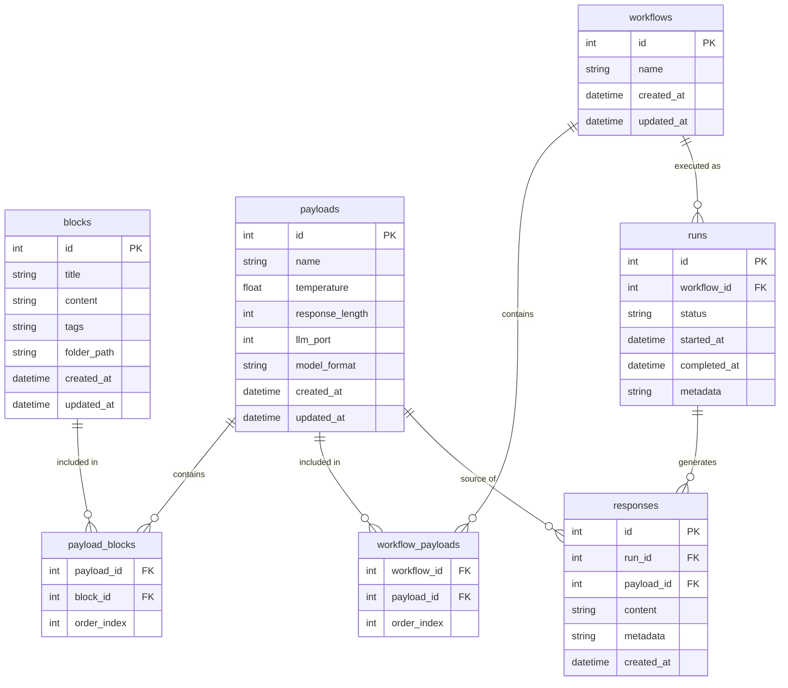

# Entity Relationship Diagram

This diagram shows the relationships between tables in the LLM Orchestration database.

## Table Relationships

### One-to-Many Relationships:

1. **blocks to payload_blocks**: One block can be included in many payloads
2. **payloads to payload_blocks**: One payload can contain many blocks
3. **payloads to workflow_payloads**: One payload can be included in many workflows
4. **workflows to workflow_payloads**: One workflow can contain many payloads
5. **workflows to runs**: One workflow can be executed many times as runs
6. **runs to responses**: One run can generate many responses
7. **payloads to responses**: One payload can be the source of many responses

### Primary Keys:

- **blocks**: id (auto-incrementing integer)
- **payloads**: id (auto-incrementing integer)
- **workflows**: id (auto-incrementing integer)
- **runs**: id (auto-incrementing integer)
- **responses**: id (auto-incrementing integer)

### Junction Tables:

1. **payload_blocks**: Links blocks to payloads with order information
   - Foreign keys: payload_id, block_id
   - Additional data: order_index

2. **workflow_payloads**: Links payloads to workflows with order information
   - Foreign keys: workflow_id, payload_id
   - Additional data: order_index

## Data Flow

The structure supports the following workflow:

1. Create reusable **blocks** (text snippets)
2. Combine blocks into **payloads** with LLM configuration
3. Sequence payloads into **workflows**
4. Execute workflows as **runs**
5. Store LLM outputs as **responses** linked to runs and original payloads

This allows for efficient reuse of prompt components and LLM configurations across multiple workflows.
